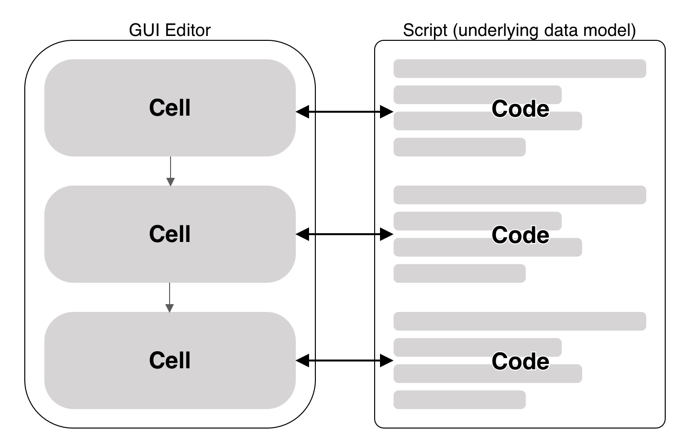

Users of data analysis software are often not statisticians or data scientists with extensive programming skills. Instead, they are typically experts or students in their own research fields who have learned established statistical methods to apply to datasets with known structures. Since graphical user interfaces (GUIs) are the most common way to interact with software, it is no surprise that these users often rely on GUI-based applications for their data analysis tasks. [][#GUI_FOR_R]

<figure id="fig-workflow">

  <figcaption>
    Diagram of a realistic data analysis workflow. The black arrows represent the idealized workflow, while the dashed arrows illustrate the actual workflow. The diagram is taken from the online book "Robust data analysis: an introduction to R" by Sina Rüeger. [][#ROBUST_DATA_ANALYSIS]
  </figcaption>
</figure>

While GUI-based data analysis tools offer a familiar interface for users without programming experience, they often have limitations that can impede the analysis process. Data analysis is complex and nonlinear, typically requiring multiple iterations of trial and error, as illustrated in figure <a class="ref" href="#fig-workflow">1</a>. GUI-based tools often constrain users to a predefined workflow, which can be restrictive. If a specific functionality is unavailable in the GUI, users must export and re-import the data to use another tool to complete a step in the analysis. Additionally, reproducing an analysis is challenging because the steps taken are not recorded in a script that can be rerun. [][#NO_GUI] [][#ROBUST_DATA_ANALYSIS]

Recognizing the challenges of current data analysis approaches, the Behavioral Security Research Group at the University of Bonn is developing a data analysis tool as part of Florin Martius' doctoral thesis: Datadive. This tool aims to provide a GUI-based platform that encompasses the entire workflow of scientific data analysis projects. During the conceptual phase, discussions with Florin Martius and other research group members identified the platform's requirements. Based on these requirements, a concept for the platform was developed.

<figure id="fig-simplified-data-model">

  <figcaption>
    A simplified representation of the Datadive data model. Each cell corresponds to a piece of code. All cells together form a script that contains the analysis workflow.
  </figcaption>
</figure>

The central component of Datadive is a cell-based interface, where each cell represents a step of the data analysis workflow. Each cell receives the output of the preceding cell and additional parameters provided by the user as input. The cells are arranged in a sequence that represents the entire analysis workflow. Users can conduct the analysis by adding, deleting, or reordering cells. To revisit a previous step, users can replace a cell or modify its input parameters.

A simplified description of the underlying data model, illustrated in figure <a class="ref" href="#fig-simplified-data-model">2</a>, is that each cell corresponds a piece of code. All cells together form a script that users can manually edit if needed. This approach combines the flexibility of code-based tools with the user-friendliness of GUI-based tools. The platform is accessible to users without programming expertise while remaining flexible enough for expert users to write code when certain functionalities are unavailable in the GUI. Additionally, the data model ensures reproducibility by recording the steps of the analysis in a script that can be rerun.

### Scope of this Thesis

The conceptual part of the thesis yielded requirements and the already described concept for the Datadive platform.

During the practical part, an architecture that implements this concept was developed, and a technical foundation for it was established. The resulting codebase is not a functional platform but serves as a starting point for future development. The main focus was on creating a maintainable codebase. This is particularly important as Datadive is developed within the context of a doctoral thesis and will be a collaborative project between the research group staff and students at the University of Bonn. To facilitate collaboration, great emphasis was placed on making it easy for staff to ensure contributions meet the project's quality standards and for developers to start contributing. Complex solutions were avoided, and the number of technologies used was limited to reduce the learning curve for new developers.

The written portion of this thesis outlines the requirements established during the conceptual phase. It describes the developed architecture and details the structure and organization of the codebase, serving as documentation. Additionally, it references the technical decisions made during development and provides an outlook on the future work needed to make the Datadive platform fully functional.

This documentation is also available as a hosted website, featuring slightly different content. The structure of both formats is loosely based on the Diataxis framework for technical documentation proposed by Daniele Procida. Both formats contain an _explanation_ section that provides context and connections to the Datadive platform, a _reference_ section that offers concise information about specific elements or features and a _guide_ section that provides step-by-step instructions for contributors. [][#DIATAXIS] [][#DATADIVE_DOCS]
